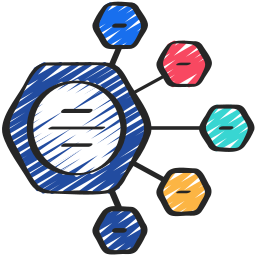

<div id="top"></div>

<!-- PROJECT SHIELDS -->
[![Contributors][contributors-shield]][contributors-url]
[![Forks][forks-shield]][forks-url]
[![Stargazers][stars-shield]][stars-url]
[![Issues][issues-shield]][issues-url]
[![MIT License][license-shield]][license-url]
<!-- END OF PROJECT SHIELDS -->

<!-- PROJECT LOGO -->
<br />
<div align="center">
    <a href="https://www.flaticon.com/free-icon/data-analytics_2299744?term=hexagon&page=1&position=24&origin=style&related_id=2299744">
        
    </a>
    <h3>VSCode Hexagonal</h3>
    <p>
        <i>This project is a sample project for creating a VS Code plugin with a hexagonal software architecture.</i>
        <br />
        <a href="https://github.com/peterhnm/vscode-hexagonal-example/issues">Report Bug</a>
        ·
        <a href="https://github.com/peterhnm/vscode-hexagonal-example/pulls">Request Feature</a>
    </p>
</div>

## About The Project

This project is a sample project for creating a VS Code plugin with a hexagonal software architecture.

### Built With

* [Yarn 2](https://yarnpkg.com/getting-started/install)
* [Tsyringe](https://github.com/microsoft/tsyringe)
* [VSCode API](https://code.visualstudio.com/api/references/vscode-api)
* [TypeScript](https://www.typescriptlang.org/)

## Getting started

1. Clone the repository
   ```shell
   https://github.com/peterhnm/vscode-hexagonal-example.git
   ```
2. Install dependencies
   ```shell
   yarn install
   ```
3. Build the project
   ```shell
   yarn build
   ```
4. Run the project in VS Code
   ```shell
   code .
   ```
   Press `F5` to run the project in debug mode.
   Within the **_Extension Host_** open the [example](example) folder.

## Documentation

<p>
   <br />
   <em>The application's rough software architecture</em>
</p>

I am using the Hexagonal Architecture as described by *Tom Hombergs* in his book
[Get Your Hands Dirty on Clean Architecture](https://www.packtpub.com/product/get-your-hands-dirty-on-clean-architecture/9781839211966).  
The plugin is an example of a [*CustomTextEditor*](https://code.visualstudio.com/api/extension-guides/custom-editors)
which reacts on `.hexagon` files.

As you can see in the diagram above, the application is divided into:

* **Input-Adapters** *"drive"* our application. In the case of a VS Code plugin, these are mainly user inputs.
* **Services** contain the business logic of our application. They are the core of our application.
* **Output-Adapters** are *"driven"* by our application to communicate with the outside world.
  In the case of a VS Code plugin, this is the VS Code API itself.

**The application core, which contains the ports and services, does not depend on VS Code.**

* [Scenarios](docs/Scenarios.md)

## Contributing

Contributions are what make the open-source community such an amazing place to learn, inspire, and create. Any
contributions you make are **greatly appreciated**.

If you have a suggestion that would make this better, please open an issue with the tag "enhancement", fork the repo and
create a pull request. You can also simply open an issue with the tag "enhancement".
Please use semantic commit messages as described
in [here](https://gist.github.com/joshbuchea/6f47e86d2510bce28f8e7f42ae84c716).  
Don't forget to give the project a star! Thanks again!

1. Open an issue with the tag "enhancement"
2. Fork the Project
3. Create your Feature Branch (`git checkout -b feature/AmazingFeature`)
4. Commit your Changes (`git commit -m 'Add some AmazingFeature'`)
5. Push to the Branch (`git push origin feature/AmazingFeature`)
6. Open a Pull Request

## License

Distributed under this [license](LICENSE).

<!-- MARKDOWN LINKS & IMAGES -->
<!-- https://www.markdownguide.org/basic-syntax/#reference-style-links -->

[contributors-shield]: https://img.shields.io/github/contributors/peterhnm/vscode-hexagonal-example.svg?style=for-the-badge

[contributors-url]: https://github.com/peterhnm/vscode-hexagonal-example/graphs/contributors

[forks-shield]: https://img.shields.io/github/forks/peterhnm/vscode-hexagonal-example.svg?style=for-the-badge

[forks-url]: https://github.com/peterhnm/vscode-hexagonal-example/network/members

[stars-shield]: https://img.shields.io/github/stars/peterhnm/vscode-hexagonal-example.svg?style=for-the-badge

[stars-url]: https://github.com/peterhnm/vscode-hexagonal-example/stargazers

[issues-shield]: https://img.shields.io/github/issues/peterhnm/vscode-hexagonal-example.svg?style=for-the-badge

[issues-url]: https://github.com/peterhnm/vscode-hexagonal-example/issues

[license-shield]: https://img.shields.io/github/license/peterhnm/vscode-hexagonal-example.svg?style=for-the-badge

[license-url]: https://github.com/peterhnm/vscode-hexagonal-example/blob/main/LICENSE
